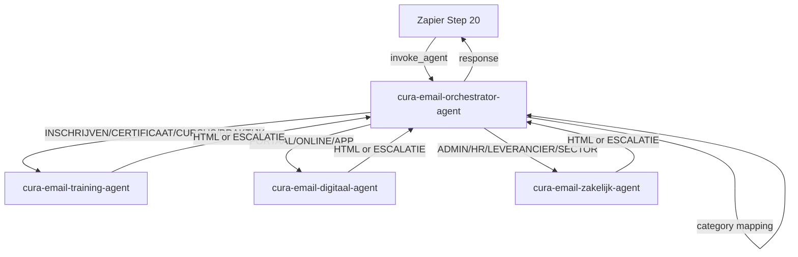

# Orchestration: cura-email-swarm

## Swarm Overview

| Field | Value |
|-------|-------|
| **Pattern** | parallel-with-orchestrator |
| **Agent count** | 4 (1 orchestrator + 3 specialists) |
| **Purpose** | Replace the single `curabhv-email-response-agent` at Zapier step 20 with a category-routed swarm that delegates email drafting to domain-specific specialists |
| **Orchestrator** | `cura-email-orchestrator-agent` |
| **Specialists** | `cura-email-training-agent`, `cura-email-digitaal-agent`, `cura-email-zakelijk-agent` |
| **Shared KB** | CURA BHV Notion KB (`01KKE67KZ3VTZD40H48847X0VM`) |
| **Folder** | EASY email |

## Agent-as-Tool Assignments

The orchestrator uses Orq.ai's `team_of_agents` to access specialists via `call_sub_agent`.

### Orchestrator: `cura-email-orchestrator-agent`

**Tools:**
```json
[
  { "type": "retrieve_agents" },
  { "type": "call_sub_agent" }
]
```

**team_of_agents:**
```json
["cura-email-training-agent", "cura-email-digitaal-agent", "cura-email-zakelijk-agent"]
```

**Knowledge bases:** none

**Model:** `openai/gpt-4.1-mini` (deterministic routing, no content generation)

### Specialists (all three)

**Tools (identical for each):**
```json
[
  { "type": "query_knowledge_base" },
  { "type": "retrieve_knowledge_bases" }
]
```

**Knowledge bases:**
```json
[
  { "knowledge_id": "01KKE67KZ3VTZD40H48847X0VM" }
]
```

**Model:** `anthropic/claude-sonnet-4-20250514` (content generation)

## Data Flow Diagram



### Step-by-step flow

1. **Zapier step 20** invokes `cura-email-orchestrator-agent` with routing metadata + email context (same input as the current `curabhv-email-response-agent`)
2. **Orchestrator** extracts the `categorie` field and maps it to a specialist agent
3. **Orchestrator** calls the matched specialist via `call_sub_agent`, passing the complete input unmodified
4. **Specialist** queries the CURA BHV KB (max 2 queries), composes an HTML draft reply or returns `[ESCALATIE]`
5. **Orchestrator** returns the specialist's response verbatim — no modification, no wrapping
6. **Zapier step 21** creates a draft reply in Outlook using the HTML output, or handles the `[ESCALATIE]` signal

## Setup Steps

Create agents in Orq.ai Studio in this order. Specialists must exist before the orchestrator can reference them.

### Step 1: Create specialist agents

Create all three in the **EASY email** folder. Order does not matter between specialists.

**1a. cura-email-training-agent**

| Setting | Value |
|---------|-------|
| Key | `cura-email-training-agent` |
| Display name | Training & Cursus Email Specialist |
| Primary model | `anthropic/claude-sonnet-4-20250514` |
| Fallbacks | `openai/gpt-4.1` → `google-ai/gemini-2.5-pro` → `anthropic/claude-sonnet-4-5-20250929` |
| Temperature | 0.4 |
| Max tokens | 1500 |
| Tools | `query_knowledge_base`, `retrieve_knowledge_bases` |
| Knowledge bases | `01KKE67KZ3VTZD40H48847X0VM` |
| Instructions | See `agents/cura-email-training-agent.md` |

**1b. cura-email-digitaal-agent**

| Setting | Value |
|---------|-------|
| Key | `cura-email-digitaal-agent` |
| Display name | Digitaal & Portaal Email Specialist |
| Primary model | `anthropic/claude-sonnet-4-20250514` |
| Fallbacks | `openai/gpt-4.1` → `google-ai/gemini-2.5-pro` → `anthropic/claude-sonnet-4-5-20250929` |
| Temperature | 0.3 |
| Max tokens | 1500 |
| Tools | `query_knowledge_base`, `retrieve_knowledge_bases` |
| Knowledge bases | `01KKE67KZ3VTZD40H48847X0VM` |
| Instructions | See `agents/cura-email-digitaal-agent.md` |

**1c. cura-email-zakelijk-agent**

| Setting | Value |
|---------|-------|
| Key | `cura-email-zakelijk-agent` |
| Display name | Zakelijk & Administratie Email Specialist |
| Primary model | `anthropic/claude-sonnet-4-20250514` |
| Fallbacks | `openai/gpt-4.1` → `google-ai/gemini-2.5-pro` → `anthropic/claude-sonnet-4-5-20250929` |
| Temperature | 0.3 |
| Max tokens | 1024 |
| Tools | `query_knowledge_base`, `retrieve_knowledge_bases` |
| Knowledge bases | `01KKE67KZ3VTZD40H48847X0VM` |
| Instructions | See `agents/cura-email-zakelijk-agent.md` |

### Step 2: Create orchestrator agent

**2. cura-email-orchestrator-agent**

| Setting | Value |
|---------|-------|
| Key | `cura-email-orchestrator-agent` |
| Display name | CURA Email Orchestrator |
| Primary model | `openai/gpt-4.1-mini` |
| Fallbacks | `azure/gpt-4.1-mini` → `google-ai/gemini-2.5-flash` → `groq/llama-3.3-70b-versatile` |
| Temperature | 0 |
| Max tokens | 4096 |
| Tools | `retrieve_agents`, `call_sub_agent` |
| Knowledge bases | none |
| team_of_agents | `["cura-email-training-agent", "cura-email-digitaal-agent", "cura-email-zakelijk-agent"]` |
| Instructions | See `agents/cura-email-orchestrator-agent.md` |

### Step 3: Verify wiring

1. Open the orchestrator in Orq.ai Studio
2. Confirm `team_of_agents` lists all three specialist keys
3. Test with a sample input (see Input/Output Contract below)
4. Verify the orchestrator calls the correct specialist and returns their output unchanged

## Category-to-Agent Routing Table

| Category | Specialist Agent | Group |
|----------|-----------------|-------|
| `INSCHRIJVEN-ANNULEREN-WIJZIGEN` | `cura-email-training-agent` | Training & Cursus |
| `CERTIFICAAT-HERCERTIFICERING` | `cura-email-training-agent` | Training & Cursus |
| `CURSUSAANBOD-LEERPADEN` | `cura-email-training-agent` | Training & Cursus |
| `PRAKTIJKSESSIES-OEFENEN-LOCATIE` | `cura-email-training-agent` | Training & Cursus |
| `PORTAAL-INLOG-HARDNEKKIG` | `cura-email-digitaal-agent` | Digitaal & Portaal |
| `ONLINE-LEEROMGEVING-OPDRACHTEN` | `cura-email-digitaal-agent` | Digitaal & Portaal |
| `PORTAAL-APP-GEBRUIK` | `cura-email-digitaal-agent` | Digitaal & Portaal |
| `ADMINISTRATIE-PRIVACY-GEGEVENSVERWERKING` | `cura-email-zakelijk-agent` | Zakelijk & Administratie |
| `HR-SYSTEMEN-SYSTEEMINTEGRATIES` | `cura-email-zakelijk-agent` | Zakelijk & Administratie |
| `LEVERANCIER-OFFERTE` | `cura-email-zakelijk-agent` | Zakelijk & Administratie |
| `SECTOR-MAATWERK-VRAGEN` | `cura-email-zakelijk-agent` | Zakelijk & Administratie |

**Categories that never reach the orchestrator** (filtered upstream by Zapier steps 8-9 and the Routing Agent at step 11):
- `GEEN-ACTIE-NODIG`, `INTERNE-COMMUNICATIE`, `SYSTEEM-*`, `KLACHTEN-FEEDBACK-CONTACT`

## Input/Output Contract

### Input (Zapier step 20 sends to orchestrator)

The orchestrator receives the same input format as the current `curabhv-email-response-agent`:

```
Routing Agent output:
  - routing: AI_CAN_ANSWER
  - kb_urls: [{urls}]
  - kb_onderwerp: {topic}
  - vraag_type: {informatie|actie|klacht|feedback|overig}
  - detected_language: {nl|en|de|...}
  - confidence: {0-100}
  - motivatie: {text}

Original email context:
  - Subject: {subject}
  - Body: {cleaned email text}
  - Sender name: {name}
  - Sender email: {email}
  - Sentiment: {positief|neutraal|negatief}
  - Sentiment score: {0-100}
  - Category: {CATEGORIE}
```

### Output (orchestrator returns to Zapier)

**Success** — HTML email draft (pass-through from specialist):

```html
Beste {naam},<br><br>{email body}<br><br>Met vriendelijke groet,<br>CURA BHV
```

**Escalation** — one of three formats:

```
[ESCALATIE] Geen passend kennisbankartikel gevonden voor: {omschrijving}. Reden: {waarom}. Deze mail moet door een medewerker worden beantwoord.
```

```
[ESCALATIE] Categorie niet herkend — handmatige beoordeling vereist.
```

```
[ESCALATIE] Specialist agent fout — mail moet handmatig worden beantwoord.
```

**Contract guarantee:** The output format is identical to the current `curabhv-email-response-agent`. Zapier step 21 (create Outlook draft) requires no changes.

## Error Handling

| Scenario | Handler | Response |
|----------|---------|----------|
| Category not in routing table | Orchestrator | `[ESCALATIE] Categorie niet herkend — handmatige beoordeling vereist.` |
| Category field missing from input | Orchestrator | `[ESCALATIE] Categorie niet herkend — handmatige beoordeling vereist.` |
| Specialist agent call fails or times out | Orchestrator | `[ESCALATIE] Specialist agent fout — mail moet handmatig worden beantwoord.` |
| Specialist returns empty/null response | Orchestrator | `[ESCALATIE] Specialist agent fout — mail moet handmatig worden beantwoord.` |
| Specialist returns `[ESCALATIE]` | Orchestrator | Passes through the `[ESCALATIE]` message unchanged |
| KB has no relevant article | Specialist | `[ESCALATIE] Geen passend kennisbankartikel gevonden voor: {omschrijving}. Reden: {waarom}. Deze mail moet door een medewerker worden beantwoord.` |
| Specialist exceeds 2 KB queries without result | Specialist | Escalates (same format as above) |

**Key principle:** All error paths produce an `[ESCALATIE]` message. Zapier's downstream branching already handles this signal — the email gets moved to the manual review folder.

## KB Design

### Shared Knowledge Base

| Field | Value |
|-------|-------|
| **Name** | CURA BHV Notion KB |
| **ID** | `01KKE67KZ3VTZD40H48847X0VM` |
| **Status** | Already provisioned in Orq.ai |
| **Source** | Notion |
| **Used by** | `cura-email-training-agent`, `cura-email-digitaal-agent`, `cura-email-zakelijk-agent` |
| **Not used by** | `cura-email-orchestrator-agent` (no KB tools, no KB access) |

### Content coverage per specialist

| Specialist | KB content areas |
|-----------|------------------|
| Training | Training schedules, certification policies (1-year validity), enrollment procedures, cancellation policies, course content descriptions, practical session locations, hercertificering timelines |
| Digitaal | Portal login guides, digi-instructeur documentation, ThuisCompetentBox instructions, assignment upload procedures, klantenportaal navigation, troubleshooting steps |
| Zakelijk | Administrative procedures, privacy/AVG policies, verwerkersovereenkomst information, general business information |

### KB query rules

- Max **2 queries** per specialist invocation
- Use `kb_onderwerp` and `kb_urls` from the Routing Agent as primary search input
- First query: specific to the topic
- Second query (if needed): broader/alternative terms
- If 2 queries yield no relevant result: escalate

## Migration Guide

### Overview

The existing 22-step Zapier flow stays **completely unchanged** except for one field in step 20: the `agent_key`.

| What | Before | After |
|------|--------|-------|
| Zapier step 20 `agent_key` | `curabhv-email-response-agent` | `cura-email-orchestrator-agent` |
| Input format | Unchanged | Unchanged |
| Output format | Unchanged | Unchanged |
| All other Zapier steps (1-19, 21-22) | Unchanged | Unchanged |

### Step-by-step migration

**Phase 1: Create agents (Orq.ai Studio)**

1. Create `cura-email-training-agent` in the EASY email folder
2. Create `cura-email-digitaal-agent` in the EASY email folder
3. Create `cura-email-zakelijk-agent` in the EASY email folder
4. Create `cura-email-orchestrator-agent` in the EASY email folder
5. Configure `team_of_agents` on the orchestrator: `["cura-email-training-agent", "cura-email-digitaal-agent", "cura-email-zakelijk-agent"]`

**Phase 2: Test (Orq.ai Playground)**

6. Test the orchestrator with sample emails from each category group
7. Verify correct routing (training categories go to training specialist, etc.)
8. Verify HTML output format matches the current Response Agent output
9. Verify `[ESCALATIE]` pass-through works correctly
10. Test edge cases: unknown category, empty category field

**Phase 3: Switch in Zapier**

11. Open the Zapier flow
12. Navigate to **step 20** (currently using `curabhv-email-response-agent`)
13. Change the `agent_key` value from `curabhv-email-response-agent` to `cura-email-orchestrator-agent`
14. Save the Zap — no other steps need modification

**Phase 4: Monitor**

15. Monitor the first week of operation
16. Compare escalation rate and draft quality with the previous single-agent setup
17. Check Orq.ai traces to verify routing correctness
18. Keep `curabhv-email-response-agent` active as a rollback target — if issues arise, revert step 20 back to the old agent key

### Rollback

If the swarm produces worse results than the single agent:

1. Open Zapier step 20
2. Change `agent_key` back to `curabhv-email-response-agent`
3. Save — the old agent is still active and unchanged
